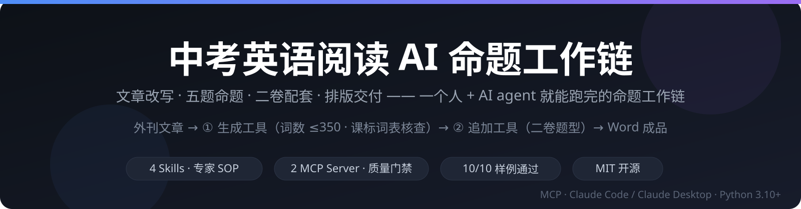
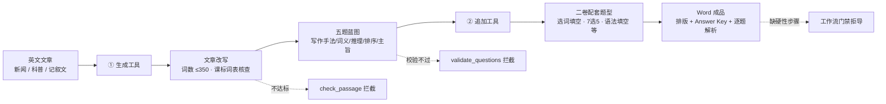

<div align="center">



# 中考英语阅读 AI 命题工作链

**把「文章改写 → 五题命题 → 二卷配套 → 排版交付」做成一个人就能跑完的 AI agent 工作链。**

由 AI Agent（Claude Code / Claude Desktop 等）配合 MCP Server 驱动 · 纯本地运行

[](LICENSE)
[](https://www.python.org/)
[](https://modelcontextprotocol.io/)
[](https://claude.ai/)
[](#%E6%9E%B6%E6%9E%84)
[](https://github.com/Tim-JoJo/zhongkao-reading-toolchain)

</div>

---

## 这是什么

一套面向**九年级（中考）英语阅读**命题与组卷的本地工具链，包含两个可独立使用的工具。它把资深教研员的命题规范固化为**机器可校验的硬指标**：AI 负责改写与出题，代码负责把关质量，人只做需求设定与终审。

> 适用场景：中学英语教研组日常命题组卷 · 教辅与在线教育内容生产 · 教师备课资源建设 · 师范生命题实训

## 工作流



## 工具一览

| 工具 | 目录 | 作用 |
|------|------|------|
| **阅读理解题目生成工具** | [`阅读理解题目生成工具/`](阅读理解题目生成工具/) | 把一篇英文文章改写为九年级中考阅读文章，生成配套五道选择题，输出带排版、答案与逐题解析的 Word。内含 4 个 Skill + 2 个 MCP server（指标检查 / 生词覆盖率）。 |
| **阅读理解题目追加工具** | [`阅读理解题目追加工具/`](阅读理解题目追加工具/) | 在改编版 docx 尾部追加二卷配套题型（选词填空 / 7选5 / 语法填空 / 首字母填空 / 阅读问答 / 阅读单选），自动套排版规则。纯 Python，仅依赖 `python-docx`。 |

## 快速开始

```bash
# 1. 安装依赖
pip install -r 阅读理解题目生成工具/requirements.txt
python -m spacy download en_core_web_sm        # 生词核查所需词形还原模型

# 2. 配置 MCP：把 .mcp.json 复制到你的 agent 项目根目录，
#    将其中两处 <工具根目录> 替换为本工具包的绝对路径

# 3. 重启 agent 会话，确认出现 mcp__zhongkao-mcp__* 与 mcp__vocab-checker__* 工具
```

然后按各工具目录内 README 操作：

- 生成工具：先读 [`阅读理解题目生成工具/README.md`](阅读理解题目生成工具/README.md)，开工前必读其 [`CLAUDE.md`](阅读理解题目生成工具/CLAUDE.md)（操作硬性约定）
- 追加工具：见 [`阅读理解题目追加工具/README.md`](阅读理解题目追加工具/README.md)

## 核心质量机制

质量不靠自觉，靠代码。以下门槛全部由 MCP 工具执行，不通过即拒绝导出：

| 校验项 | 阈值 / 规则 | 处理方式 |
|---|---|---|
| 正文词数 | **≤ 350**（硬门槛） | 超限直接失败，不作复核 |
| 生词范围 | 对照课标词表 **3,585 词条**（含 2,795+ 课标词汇与词形/词组补充）逐词核查（词形还原） | 列出超纲词逐词处理 |
| 句长 | 句均 13–15 词 · P90 ≤ 24 | 需复核 |
| 原创性 | 逐字引用原文检测 | 检出即拦截，必须改写 |
| 题目质量 | 答案唯一 · 证据可追溯 · 题型与标号规范 | `validate_questions` 必须 all_pass |
| 流程完整 | 未抽蓝图 / 校验未过 / 注释缺失 | 工作流门禁直接拒绝导出 |

## 架构

| 层次 | 组成 | 职责 |
|---|---|---|
| 执行层 | AI agent（支持 MCP 的任意客户端） | 按 Skill 编排任务、调用 MCP 工具 |
| 规范层 | 4 个 Skill（`SKILL.md` + `references/`） | 文章改写 · 出题 · 题型参考 · 行文模块库 |
| 工具层 | 2 组自研 MCP server | `zhongkao-mcp`：指标检查 / 题目校验 / Word 导出；`vocab-checker`：课标词表覆盖率 |
| 数据层 | 课标词表 · 题型库 · 题干句式库 · 行文模块库 · 工作流状态文件 | 领域知识沉淀与跨会话流程状态 |
| 交付层 | Word 试卷 + 解析报告（`python-docx` 渲染） | 排版即用，含 Answer Key 与荧光标注报告 |

## 实测样例

2026-09 以 10 篇公开英文素材（VOA Learning English / Simple English Wikipedia）完成端到端运行：

| 指标 | 结果 |
|---|---|
| 通过率 | **10 / 10** 通过 `check_passage` + `validate_questions`（复核零问题） |
| 正文词数 | 250 – 316 词 |
| 课标词表覆盖率 | 95.4% – 96.5%（超纲词 5 – 7 个） |
| 句长 | 句均 13.5 – 14.7 · P90 17 – 20 |
| 交付物 | 每份含题干、A–D 选项、Answer Key 与逐题解析 |

## 质量 hook（自动校验）

把「容易遗漏、容易改回来」的点做成可回归的校验，而不是靠下次记得。每条 hook 都对应一次真实事故：

```bash
pytest hook -q        # 全量（装了 spacy 就跑蓝图种子扫描，否则自动跳过）
pytest hook -q -k doc # 只跑文档一致性（纯文本，毫秒级）
```

覆盖：词表口径与引用路径一致性 · 荧光图例色数与导出器同步 · 「必答 N 问」条目数 · 反例黑名单编号范围 ·
MCP 工具表与文档一致 · 阈值与导出成功前缀单一来源 · 蓝图加权分布契约 · 校验器误报与「无兜底项」特征化 ·
导出门禁（含**正文内容指纹**：改文后必须重跑校验，只加中文注释不算改）· 导出文档字体与苹方标号。

提交前自动跑：`git config core.hooksPath .githooks`（装 git hook）；推送到 GitHub 后由 `.github/workflows/hooks.yml` 再跑一遍。

## 前置要求

- **Python 3.10+**
- **支持 MCP 的 agent**（Claude Code / Claude Desktop 等）
- 可选：MinerU（把 PDF / 网页解析为文本输入）

## 目录结构

```
zhongkao-reading-toolchain/
├── README.md                          ← 本文件
├── LICENSE                            ← MIT
├── 阅读理解题目生成工具/               ← 主工具：文章改写 + 题目生成
│   ├── CLAUDE.md                      ← 操作硬性约定（开工前必读）
│   ├── .mcp.json                      ← MCP 配置模板
│   └── Part1-文章改写/ · Part2-题目生成/
└── 阅读理解题目追加工具/               ← 二卷配套题目追加
```

## 常见问题

<details>
<summary><b>MCP 工具没有出现在会话里？</b></summary>

检查 `.mcp.json` 中 `<工具根目录>` 是否已替换为真实绝对路径；路径正确后重启 agent 会话即可重新加载。
</details>

<details>
<summary><b><code>ModuleNotFoundError: spacy</code></b></summary>

依赖未装全，重跑快速开始第 1 步；词表核查还需要 `python -m spacy download en_core_web_sm`。
</details>

<details>
<summary><b>覆盖率偏低怎么办？</b></summary>

按 `check_passage` 返回的 `unknown_words` 逐词替换或调整档位；注意正文中的中文注释会影响分词，指标检查应使用无注释正文。
</details>

<details>
<summary><b>想跳过校验直接导出？</b></summary>

导出门禁会直接拒绝并返回缺步清单。按提示补做对应步骤，不要绕过拦截——这是本项目的质量底线。
</details>

## 致谢

- [Model Context Protocol](https://modelcontextprotocol.io/) —— agent 与工具之间的标准协议
- [spaCy](https://spacy.io/) · [python-docx](https://python-docx.readthedocs.io/) —— 词形还原与文档排版
- 词汇核查依据：中华人民共和国教育部《义务教育英语课程标准（2022 年版）》词汇表

## 许可

MIT License，见 [LICENSE](LICENSE)。

> 工具输出为 AI 辅助生成内容，正式用于考试命题或公开发布前须经人工终审。
